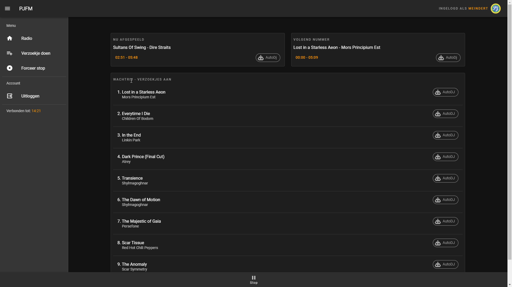
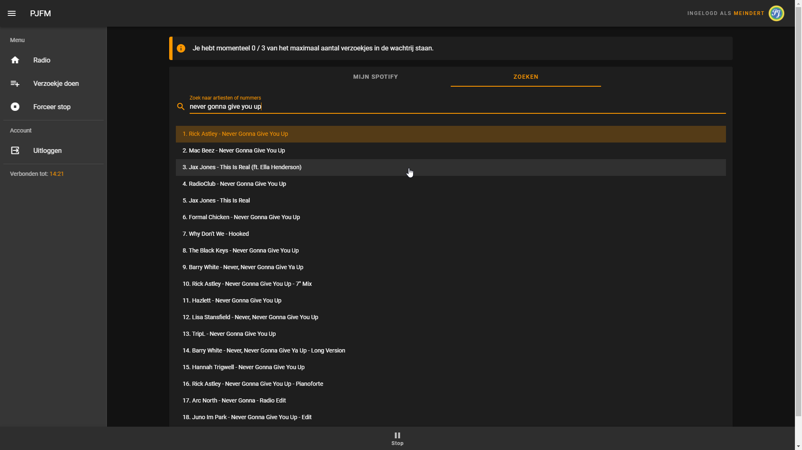

# PJFM

This repository contains all the source code for the the [pfjm](https://pjfm.nl) web-application.

## Description

Pfjm is an application build with the Spotify API which is in essence, is a 24/7 radio station where users can synchronize with through their Spotify client.
A 24/7 playback feed is constantly generated, containing the favorite tracks of registered users. Trough the application, users can also make song requests with messages that will be played by the playback system.

## Screenshots
**Homepage**

**Sending requests**

